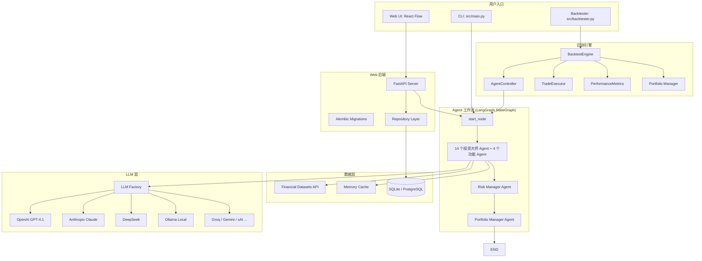
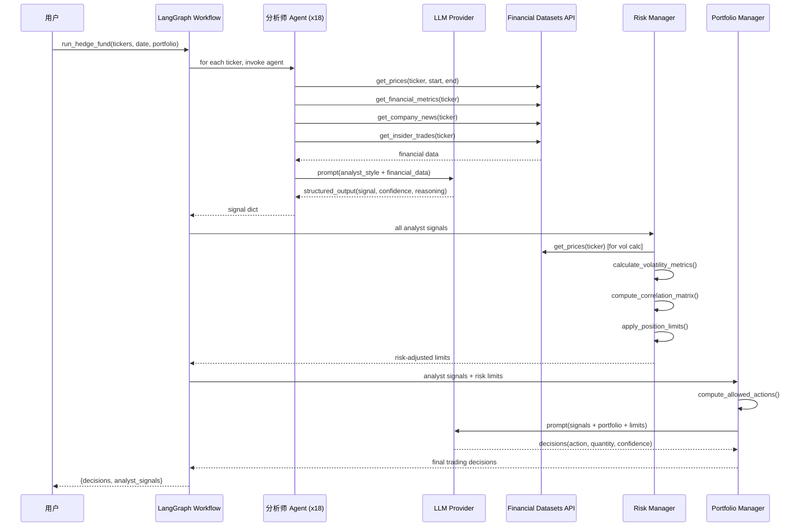

# AI Hedge Fund 深度分析报告

> **分析日期**: 2026-06-17
> **项目版本**: 2026.6.9
> **许可证**: MIT License

## 1. 项目概述

### 1.1 项目简介

AI Hedge Fund 是一个基于 AI 的多智能体（Multi-Agent）对冲基金交易系统概念验证项目（Proof of Concept），由 Virat Singh 创建并维护。该项目通过 **19 个 AI Agent 协作**来完成股票交易决策：14 个以知名投资大师命名的选股 Agent（如 Warren Buffett、Ben Graham 等）分别给出买卖信号，再由风险管理器和投资组合经理 Agent 进行综合决策。项目明确声明 **仅用于教育和研究目的**，不适用于真实交易。

### 1.2 主要特性

- **多智能体协作系统**：19 个 Agent 通过 LangGraph 状态图（StateGraph）组织为工作流，涵盖基本面分析、技术分析、情绪分析、风险管理到投资组合决策的完整链路
- **14 位投资大师 Agent**：每个 Agent 模拟一位知名投资人的选股风格（价值投资、成长投资、逆向投资、宏观交易等），通过 LLM 生成独立信号
- **4 个功能型 Agent**：Valuation Agent（估值）、Sentiment Agent（情绪）、Fundamentals Agent（基本面）、Technicals Agent（技术指标）
- **风险管理模块**：基于波动率调整的仓位控制、相关性分析、VaR 计算、集中度限制
- **投资组合经理**：综合所有信号做出最终交易决策（买入/卖出/做空/平仓/持有）
- **回测引擎**：支持历史数据回测，包含夏普比率、最大回撤、Sortino 比率等绩效指标
- **Web 可视化应用**：基于 React/Next.js 的拖拽式流程图界面，支持可视化构建 Agent 工作流
- **多 LLM 提供商**：支持 OpenAI、Anthropic、DeepSeek、Groq、Google Gemini、Ollama 等 12 种 LLM 提供商
- **V2 架构**：独立的 v2/ 目录包含重新设计的事件研究（Event Study）、因子模型、信号生成等模块

### 1.3 版本演进

项目当前版本 2026.6.9，从 CHANGELOG 信息推断持续活跃开发。主要演进方向：

- **初始版本**：核心多 Agent 工作流，CLI 运行模式
- **中期演进**：新增回测引擎、绩效指标计算
- **近期演进**：新增 Web 应用界面（app/ 目录），引入拖拽式工作流编辑器
- **最新演进**：新增 Docker 部署支持，V2 架构探索（事件研究、因子模型），Ollama 本地模型支持，扩展 LLM 提供商（至 12 家）

## 2. 技术栈深度剖析

| 层级 | 技术/库 | 版本 | 在项目中的作用 |
|------|---------|------|---------------|
| 语言 | Python | >= 3.11 | 核心开发语言 |
| AI Agent 框架 | LangChain | >= 0.3.7 | LLM 调用抽象层，提供链式调用和结构化输出 |
| 图工作流 | LangGraph | 0.2.56 | 定义 Agent 协作有向无环图（DAG） |
| LLM - OpenAI | langchain-openai | >= 0.3.5 | GPT-4o / GPT-4.1 等模型调用 |
| LLM - Anthropic | langchain-anthropic | 0.3.5 | Claude 系列模型调用 |
| LLM - DeepSeek | langchain-deepseek | >= 0.1.2 | DeepSeek 模型调用 |
| LLM - Ollama | langchain-ollama | 0.3.6 | 本地 LLM 推理支持 |
| LLM - Google | langchain-google-genai | >= 2.0.11 | Gemini 模型调用 |
| 数据科学 | pandas / numpy | >= 2.1.0 / >= 1.24.0 | 数据处理和计算 |
| 统计分析 | scipy | >= 1.11.0 | 统计方法（相关性等） |
| 可视化 | matplotlib | >= 3.9.2 | 回测结果图表 |
| CLI 交互 | questionary / rich | >= 2.1.0 / >= 13.9.4 | 交互式 CLI、格式化输出 |
| 配置管理 | python-dotenv | 1.0.0 | .env 文件环境变量加载 |
| **Web 后端** | | | |
| Web 框架 | FastAPI | >= 0.104.0 | REST API 服务 |
| ORM | SQLAlchemy | >= 2.0.22 | 数据库 ORM |
| 迁移工具 | Alembic | >= 1.12.0 | 数据库 Schema 迁移 |
| 数据验证 | Pydantic | >= 2.4.2 | 请求/响应模型验证 |
| **Web 前端** | | | |
| 框架 | React / TypeScript | - | 前端 UI 框架 |
| 构建工具 | Vite | - | 前端打包 |
| 样式 | Tailwind CSS | - | CSS 框架 |
| 流程图库 | @xyflow/react (React Flow) | - | 节点编辑器实现 |
| 包管理 | pnpm | - | 依赖管理 |
| **DevOps** | | | |
| 容器化 | Docker / docker-compose | - | 容器化部署 |
| 构建工具 | Poetry | - | Python 依赖管理 |
| 测试 | pytest | >= 7.4.0 | 单元测试和集成测试 |
| 代码质量 | black / isort / flake8 | - | 格式化、导入排序、Lint |

**技术选型分析**：项目的核心创新在于 **LangGraph StateGraph 的多 Agent 编排能力**。LangChain 生态提供了统一的 LLM 调用接口（`with_structured_output` 实现 JSON Schema 约束的输出），LangGraph 则定义了 Agent 之间的协作拓扑。项目充分利用了 LangChain 的 `ChatPromptTemplate` 来为每个 Agent 定制 System Prompt，并通过 Pydantic 模型约束结构化输出。Web 应用前端的 React Flow 流程图编辑器和后端的 LangGraph 工作流形成了"所见即所得"的 Agent 编排体验，这是项目区别于其他 AI 交易系统的重要特色。

## 3. 系统架构与目录结构

### 3.1 顶层目录结构

```
ai-hedge-fund/
├── app/                # Web 全栈应用
│   ├── backend/        # FastAPI 后端（REST API + 数据库）
│   │   ├── alembic/    # 数据库迁移
│   │   ├── database/   # 数据库连接和模型
│   │   ├── models/     # Pydantic 数据模型
│   │   ├── repositories/  # 数据仓库层
│   │   ├── routes/     # API 路由
│   │   └── services/   # 业务逻辑层（graph, agent, portfolio, backtest）
│   └── frontend/       # React/TypeScript 前端
│       └── src/        # 前端组件、上下文、节点、服务
├── docker/             # Docker 部署配置
├── scripts/            # 发布脚本
├── src/                # 核心 Python 源码
│   ├── agents/         # 18 个 Agent 实现 + 投资组合/风险管理器
│   ├── backtesting/    # 回测引擎
│   ├── cli/            # CLI 交互输入解析
│   ├── data/           # 数据模型和内存缓存
│   ├── graph/          # LangGraph 状态定义
│   ├── llm/            # LLM 模型配置和工厂
│   ├── tools/          # Financial Datasets API 客户端
│   └── utils/          # 工具函数（分析师配置、API Key、显示、可视化）
├── tests/              # 测试目录
│   ├── backtesting/    # 回测单元测试和集成测试
│   └── fixtures/       # API 响应测试夹具
├── v2/                 # 第二版架构实验
│   ├── backtesting/    # V2 回测引擎
│   ├── data/           # V2 数据客户端
│   ├── event_study/    # 事件研究引擎
│   ├── features/       # 特征工程
│   ├── portfolio/      # 投资组合优化
│   ├── risk/           # 风险管理
│   └── signals/        # 信号生成
├── pyproject.toml      # Poetry 项目配置
├── .env.example        # 环境变量示例
└── docker-compose.yml  # Docker 编排
```

### 3.2 核心模块目录职责

| 目录/模块 | 职责说明 | 关键文件 |
|-----------|---------|---------|
| `src/agents/` | 14 位投资大师 Agent + 4 个功能 Agent + Risk/Portfolio Manager | `warren_buffett.py`, `valuation.py`, `risk_manager.py`, `portfolio_manager.py` |
| `src/graph/` | LangGraph 状态定义（AgentState）和工作流编排 | `state.py` |
| `src/backtesting/` | 回测引擎（控制器、交易执行器、指标计算器） | `engine.py`, `controller.py`, `trader.py`, `metrics.py` |
| `src/tools/` | Financial Datasets API 客户端（股票价格、财务指标、新闻等） | `api.py` |
| `src/data/` | 数据模型（Pydantic）和内存缓存 | `models.py`, `cache.py` |
| `src/llm/` | LLM 提供商抽象层和管理 | `models.py` |
| `src/utils/` | 分析师注册表、API Key 管理、LLM 调用、可视化 | `analysts.py`, `llm.py`, `api_key.py` |
| `app/backend/` | FastAPI Web 服务 | `main.py`, `services/graph.py` |
| `app/frontend/` | React 拖拽式流程图编辑器 | `src/components/`, `src/nodes/` |
| `v2/` | 下一代架构探索（事件研究、因子模型、优化器） | `event_study/`, `signals/`, `portfolio/` |
| `tests/` | 单元测试和集成测试 | `test_*.py` |

### 3.3 系统架构图



### 3.4 核心数据流



### 3.5 模块依赖关系

- **核心依赖（被最多模块引用）**: `src/graph/state.py` 中的 `AgentState` 是贯穿所有 Agent 的数据契约；`src/utils/llm.py` 的 `call_llm()` 是每个 Agent 都要调用的核心函数
- **单向依赖链**: CLI/Web → `src/main.py` (run_hedge_fund) → LangGraph StateGraph → Agents → LLM + API
- **无循环依赖**: 所有 Agent 之间相互独立，通过 LangGraph 的工作流拓扑耦合
- **松耦合设计**: 新增 Agent 只需在 `src/utils/analysts.py` 中注册，自动被工作流发现；新增 LLM 提供商只需在 `src/llm/models.py` 添加枚举和工厂映射

## 4. 配置系统分析

### 4.1 配置方式

| 配置来源 | 优先级 | 加载方式 | 典型配置项 |
|---------|--------|---------|-----------|
| CLI 参数 | 最高 | `argparse` 在 `src/cli/input.py` 解析 | tickers, start_date, end_date, model_name, analyst 选择 |
| 环境变量 | 高 | `python-dotenv` 加载 `.env` 文件 | API Keys (OPENAI_API_KEY, FINANCIAL_DATASETS_API_KEY 等 12 个) |
| 硬编码默认值 | 低 | `src/llm/api_models.json` 和源码常量 | LLM 模型列表、默认超参数 |

### 4.2 核心配置项详解

| 参数名 | 类型 | 默认值 | 说明 |
|--------|------|--------|------|
| `OPENAI_API_KEY` | str | - | OpenAI API 密钥（必需至少设置一个 LLM Key） |
| `FINANCIAL_DATASETS_API_KEY` | str | - | Financial Datasets API 密钥 |
| `ANTHROPIC_API_KEY` | str | - | Anthropic Claude API 密钥 |
| `DEEPSEEK_API_KEY` | str | - | DeepSeek API 密钥 |
| `GROQ_API_KEY` | str | - | Groq API 密钥 |
| `GOOGLE_API_KEY` | str | - | Google Gemini API 密钥 |
| `XAI_API_KEY` | str | - | xAI API 密钥 |
| `MOONSHOT_API_KEY` | str | - | Moonshot (Kimi) API 密钥 |
| `AZURE_OPENAI_API_KEY` | str | - | Azure OpenAI API 密钥 |
| `--ticker` | str list | - | 要分析的股票代码（如 AAPL,MSFT,NVDA） |
| `--start-date` | str | 1 个月前 | 分析开始日期 |
| `--end-date` | str | 今天 | 分析结束日期 |
| `--model-name` | str | gpt-4.1 | LLM 模型名称 |
| `--model-provider` | str | OpenAI | LLM 提供商 |
| `--initial-cash` | float | 100000.0 | 初始资金 |
| `--margin-requirement` | float | 0.5 | 保证金要求比例 |
| `--show-reasoning` | bool | False | 是否显示 Agent 推理过程 |
| `--selected-analysts` | str list | 全部 | 选择特定分析师 |

### 4.3 配置加载流程

1. **`.env` 加载**: 在 `src/main.py` 第 17 行通过 `load_dotenv()` 加载 `.env` 文件中的 API Keys
2. **CLI 参数解析**: 通过 `argparse` 在 [src/cli/input.py](file:///d:/develop/ai-hedge-fund/src/cli/input.py) 解析命令行参数，覆盖环境变量
3. **运行时参数传递**: `run_hedge_fund()` 函数将参数传递给 `AgentState` 的 `data` 和 `metadata` 字段
4. **API Key 按需获取**: 各 Agent 通过 [get_api_key_from_state()](file:///d:/develop/ai-hedge-fund/src/utils/api_key.py) 从 state/环境变量中获取 API Key

## 5. 核心模块源码解析

### 5.1 LangGraph Workflow - 多 Agent 协作引擎

- **文件位置**: [src/main.py](file:///d:/develop/ai-hedge-fund/src/main.py)
- **核心类/函数**:
  - `create_workflow()` ([L115-L145](file:///d:/develop/ai-hedge-fund/src/main.py#L115-L145)): 创建 LangGraph StateGraph，构建 Agent 协作有向无环图
  - `run_hedge_fund()` ([L47-L96](file:///d:/develop/ai-hedge-fund/src/main.py#L47-L96)): 工作流入口，编译图并调用 Agent
- **功能描述**: 定义 Agent 的工作流拓扑：Start → 多个分析师 Agent（并行执行）→ Risk Manager → Portfolio Manager → End。这是整个系统的编排核心。
- **实现原理**:
  1. 通过 `get_analyst_nodes()` 从注册表获取所有 Agent 的 (node_name, node_func) 元组
  2. 调用 `workflow.add_node()` 注册每个 Agent 节点
  3. 使用 `workflow.add_edge("start_node", analyst_name)` 将 Start 连接到每个分析师 Agent（并行执行）
  4. 所有分析师 Agent 完成后汇聚到 `risk_management_agent` 节点
  5. 风险控制完成后流向 `portfolio_manager` 节点
  6. 最后连接到 `END` 节点
  7. `AgentState` 通过 `Annotated` 类型和 `operator.add` / `merge_dicts` 实现消息和数据的累积合并
- **设计模式**: **管道过滤器模式（Pipes and Filters）** - LangGraph 节点是过滤器，边是管道；**DAG 拓扑排序** - 编译器自动计算执行顺序
- **关键代码片段** - 工作流构建:
  ```python
  def create_workflow(selected_analysts=None):
      workflow = StateGraph(AgentState)
      workflow.add_node("start_node", start)
      analyst_nodes = get_analyst_nodes()
      for analyst_key in selected_analysts:
          node_name, node_func = analyst_nodes[analyst_key]
          workflow.add_node(node_name, node_func)
          workflow.add_edge("start_node", node_name)
      workflow.add_node("risk_management_agent", risk_management_agent)
      workflow.add_node("portfolio_manager", portfolio_management_agent)
      for analyst_key in selected_analysts:
          workflow.add_edge(analyst_nodes[analyst_key][0], "risk_management_agent")
      workflow.add_edge("risk_management_agent", "portfolio_manager")
      workflow.add_edge("portfolio_manager", END)
      workflow.set_entry_point("start_node")
      return workflow
  ```

### 5.2 投资大师 Agent（以 Warren Buffett 为例）

- **文件位置**: [src/agents/warren_buffett.py](file:///d:/develop/ai-hedge-fund/src/agents/warren_buffett.py)
- **核心类/函数**:
  - `warren_buffett_agent()`: Agent 入口函数，接收 AgentState，返回更新后的 state
  - `WarrenBuffettSignal` (Pydantic BaseModel): 定义 Agent 输出的结构化格式（signal, confidence, reasoning）
- **功能描述**: 每个投资大师 Agent 模拟一位知名投资人的选股风格和决策逻辑。Warren Buffett Agent 使用 System Prompt 嵌入"价值投资"哲学，基于基本面数据生成买卖信号。
- **实现原理**:
  1. 从 `state["data"]` 获取 tickers, start_date, end_date 等上下文
  2. 调用 `get_financial_metrics()`, `get_prices()`, `search_line_items()` 等 API 获取财务数据
  3. 构建包含投资风格提示和财务数据的 ChatPromptTemplate
  4. 通过 `call_llm(prompt, WarrenBuffettSignal, ...)` 调用 LLM 获取结构化输出
  5. 输出包含 signal（bullish/bearish/neutral）、confidence（0-100）和 reasoning 的 JSON
  6. 将信号写入 `state["data"]["analyst_signals"]`，供 Risk Manager 和 Portfolio Manager 使用
- **设计模式**: **策略模式（Strategy）** - 每个 Agent 是独立的策略实现，统一的接口签名 `(state, agent_id) -> dict`；**模板方法模式** - 通用 Agent 调用流程（fetch data → prompt → LLM → parse output）由 `call_llm()` 封装
- **关键代码片段**:
  ```python
  class WarrenBuffettSignal(BaseModel):
      signal: Literal["bullish", "bearish", "neutral"]
      confidence: float = Field(description="Confidence in the signal 0-100")
      reasoning: str = Field(description="Reasoning for the signal")

  def warren_buffett_agent(state: AgentState, agent_id: str):
      # ... 获取财务数据 ...
      prompt = ChatPromptTemplate.from_messages([
          ("system", warren_buffett_prompt),
          ("human", f"""
              Financial Metrics: {financial_metrics}
              Line Items: {line_items}
              Prices: {prices}
          """),
      ])
      result = call_llm(prompt, WarrenBuffettSignal, agent_id, state)
      signal = {"signal": result.signal, "confidence": result.confidence}
      # ... 写入 state["data"]["analyst_signals"] ...
  ```

### 5.3 Risk Manager - 风险管理 Agent

- **文件位置**: [src/agents/risk_manager.py](file:///d:/develop/ai-hedge-fund/src/agents/risk_manager.py)
- **核心类/函数**:
  - `risk_management_agent()` ([L15-L90+](file:///d:/develop/ai-hedge-fund/src/agents/risk_manager.py#L15-L90)): 主入口，对所有 ticker 进行风险评估
  - `calculate_volatility_metrics()`: 计算日波动率、年化波动率、波动率百分位
  - `calculate_var()`: 计算 Value at Risk（VaR）
- **功能描述**: Risk Manager 在所有分析师 Agent 完成后运行，基于波动率调整计算每个 ticker 的风险调整仓位限制。它是系统风控的核心。
- **实现原理**:
  1. 获取所有 ticker（含持仓中但未分析的 ticker）的价格数据
  2. 对每个 ticker 计算日波动率、年化波动率（`daily_vol * sqrt(252)`）
  3. 构建所有 ticker 收益率矩阵，计算皮尔逊相关系数矩阵
  4. 计算组合总价值和净清算价值（Net Liquidation Value）
  5. 基于波动率百分位、VaR、相关系数、集中度限制计算每个 ticker 的仓位限制
  6. 将 `remaining_position_limit` 和 `current_price` 写入 `analyst_signals`
- **设计模式**: **责任链模式（Chain of Responsibility）** - Risk Manager 在分析师 Agent 之后、Portfolio Manager 之前执行，形成风控过滤链

### 5.4 Portfolio Manager - 投资组合经理

- **文件位置**: [src/agents/portfolio_manager.py](file:///d:/develop/ai-hedge-fund/src/agents/portfolio_manager.py)
- **核心类/函数**:
  - `portfolio_management_agent()` ([L36-L95](file:///d:/develop/ai-hedge-fund/src/agents/portfolio_manager.py#L36-L95)): 主入口，生成最终交易决策
  - `compute_allowed_actions()` ([L97-L150](file:///d:/develop/ai-hedge-fund/src/agents/portfolio_manager.py#L97-L150)): 确定性计算每个 ticker 允许的操作和最大数量
  - `generate_trading_decision()`: 通过 LLM 生成最终交易决策
- **功能描述**: 投资组合经理是工作流的最终决策者，综合所有分析师信号和风险限制，做出最终买卖决策。
- **实现原理**:
  1. 从 `analyst_signals` 中提取风险管理器的 `position_limits` 和 `current_prices`
  2. 计算 `max_shares`（`position_limit // current_price`）
  3. 压缩各 Agent 信号为 `{agent_id: {sig, conf}}` 格式传递给 LLM
  4. `compute_allowed_actions()` 确定性计算买入/卖出/做空/平仓的最大数量：
     - 买入上限 = min(position_limit, cash / price)
     - 卖出上限 = 当前多头持仓数
     - 做空上限 = min(position_limit, (equity/margin_req - margin_used) / price)
  5. 调用 LLM 确定每个 ticker 的最终 action、quantity 和 confidence
- **关键代码片段** - 确定性操作计算:
  ```python
  def compute_allowed_actions(tickers, current_prices, max_shares, portfolio):
      for ticker in tickers:
          price = current_prices[ticker]
          max_qty = max_shares[ticker]
          if cash > 0 and price > 0:
              max_buy = min(max_qty, int(cash // price))
              actions["buy"] = max_buy
          if margin_requirement > 0:
              available_margin = (equity / margin_requirement) - margin_used
              max_short = min(max_qty, int(available_margin // price))
              actions["short"] = max_short
  ```

### 5.5 BacktestEngine - 回测引擎

- **文件位置**: [src/backtesting/engine.py](file:///d:/develop/ai-hedge-fund/src/backtesting/engine.py)
- **核心类/函数**:
  - `BacktestEngine.__init__` ([L37-L74](file:///d:/develop/ai-hedge-fund/src/backtesting/engine.py#L37-L74)): 初始化回测引擎
  - `BacktestEngine.run_backtest()` ([L101-L175](file:///d:/develop/ai-hedge-fund/src/backtesting/engine.py#L101-L175)): 回测主循环
  - `_prefetch_data()` ([L76-L99](file:///d:/develop/ai-hedge-fund/src/backtesting/engine.py#L76-L99)): 预取价格和财务数据
- **功能描述**: 按交易日回放历史数据，在每个交易日调用 AI Agent 工作流生成决策，执行交易，计算绩效指标。
- **实现原理**:
  1. `_prefetch_data()` 预先加载所有数据到内存缓存，避免回测中每次 API 调用
  2. 使用 `pd.date_range(start, end, freq="B")` 生成交易日序列
  3. 对每个交易日：
     - 获取当日价格数据
     - 通过 `AgentController.run_agent()` 调用 AI 工作流
     - 通过 `TradeExecutor.execute_trade()` 执行交易决策
     - 通过 `calculate_portfolio_value()` 计算组合价值
     - 通过 `compute_exposures()` 计算敞口
     - 通过 `PerformanceMetricsCalculator.compute_metrics()` 更新绩效指标
  4. 使用 `OutputBuilder` 构建和打印每日结果表格
- **性能分析**: 回测复杂度 O(D × N)，其中 D 为交易日数，N 为 Agent 数。由于每个交易日都调用 LLM，实际运行时间受 API 调用延迟主导

## 6. 接口与API文档

### 6.1 CLI 接口

| 命令 | 参数 | 说明 |
|------|------|------|
| `poetry run python src/main.py` | `--ticker AAPL,MSFT` | 运行对冲基金分析 |
| `poetry run python src/main.py` | `--ticker AAPL --start-date 2024-01-01 --end-date 2024-03-01` | 指定时间范围 |
| `poetry run python src/main.py` | `--ticker AAPL --ollama` | 使用本地 Ollama 模型 |
| `poetry run python src/main.py` | `--ticker AAPL --show-reasoning` | 显示 Agent 推理过程 |
| `poetry run python src/main.py` | `--ticker AAPL --selected-analysts warren_buffett,ben_graham` | 选择特定分析师 |
| `poetry run python src/backtester.py` | `--ticker AAPL,MSFT,NVDA` | 运行回测 |
| `poetry run python src/backtester.py` | `--ticker AAPL --initial-cash 500000 --margin-requirement 0.3` | 自定义初始资金和保证金 |

### 6.2 编程接口（Public API）

| 类/函数 | 签名 | 说明 |
|---------|------|------|
| `run_hedge_fund` | `(tickers, start_date, end_date, portfolio, show_reasoning, selected_analysts, model_name, model_provider) -> dict` | 运行对冲基金分析入口 |
| `BacktestEngine.__init__` | `(agent, tickers, start_date, end_date, initial_capital, model_name, model_provider, selected_analysts, initial_margin_requirement)` | 创建回测引擎 |
| `BacktestEngine.run_backtest` | `() -> PerformanceMetrics` | 运行回测 |
| `call_llm` | `(prompt, pydantic_model, agent_name, state, max_retries, default_factory) -> BaseModel` | 统一 LLM 调用入口 |
| `agent_func` (统一签名) | `(state: AgentState, agent_id: str) -> dict` | 所有 Agent 的统一接口签名 |

### 6.3 REST API 端点

Web 后端（FastAPI）提供以下 API，供前端 React Flow 界面调用：

| 方法 | 路径 | 参数 | 说明 |
|------|------|------|------|
| GET | `/health` | - | 健康检查 |
| POST | `/api/hedge-fund/run` | flow config, tickers, dates, model | 运行对冲基金工作流 |
| GET | `/api/flows` | - | 获取保存的工作流列表 |
| POST | `/api/flows` | flow data | 保存工作流配置 |
| GET | `/api/flows/{id}` | id | 获取特定工作流 |
| POST | `/api/backtest/run` | config | 运行回测 |
| GET | `/api/api-keys` | - | 获取 API Key 列表 |
| POST | `/api/api-keys` | key data | 保存 API Key |
| GET | `/api/ollama/models` | - | 获取本地 Ollama 模型列表 |

## 7. 数据库与存储

### 7.1 存储方案

**Web 后端使用 SQLAlchemy ORM + SQLite 数据库**（可通过配置切换为 PostgreSQL 等），用于持久化用户的工作流配置、API Keys、回测结果等数据。

**核心 CLI 模式无数据库** - CLI 模式下所有数据存储在内存中，通过 `src/data/cache.py` 的 `Cache` 类实现运行时缓存，每次运行结束后丢弃。

### 7.2 数据模型

#### HedgeFundFlow

| 字段 | 类型 | 约束 | 说明 |
|------|------|------|------|
| `id` | Integer | PK, AutoIncrement | 工作流 ID |
| `name` | String | Not Null | 工作流名称 |
| `config` | JSON | Not Null | 工作流配置（节点、边、参数） |
| `created_at` | DateTime | Not Null | 创建时间 |
| `updated_at` | DateTime | Not Null | 更新时间 |

#### HedgeFundFlowRun

| 字段 | 类型 | 约束 | 说明 |
|------|------|------|------|
| `id` | Integer | PK, AutoIncrement | 运行 ID |
| `flow_id` | Integer | FK → HedgeFundFlow.id | 关联工作流 |
| `status` | String | Not Null | 运行状态（running/completed/failed） |
| `result` | JSON | Nullable | 运行结果 |
| `created_at` | DateTime | Not Null | 运行时间 |

#### ApiKey

| 字段 | 类型 | 约束 | 说明 |
|------|------|------|------|
| `id` | Integer | PK, AutoIncrement | Key ID |
| `provider` | String | Not Null, Unique | 提供商名称 |
| `key` | String | Not Null | API Key 值 |

### 7.3 数据生命周期

1. **CLI 模式**: Agent 通过 Financial Datasets API 获取数据 → `Cache` 内存缓存（`set_prices/set_financial_metrics/set_company_news/set_insider_trades`）→ Agent 处理后丢弃
2. **Web 模式**: 用户通过 React Flow 编辑器创建工作流 → FastAPI 保存到数据库 → 运行工作流时读取 → 结果写回数据库 → 前端查询展示
3. **回测模式**: `_prefetch_data()` 预加载所有数据到内存缓存 → 每个交易日从缓存读取 → 运行结束后 PerformanceMetrics 返回内存结果

### 7.4 数据库迁移

使用 Alembic 进行数据库迁移，迁移文件位于 `app/backend/alembic/versions/`，初始迁移包含 5 个迁移脚本（创建 flows 表、runs 表、cycles 表、api_keys 表、添加 data 列）。

## 8. 测试与质量保障

### 8.1 测试概览

| 维度 | 数据 |
|------|------|
| 测试框架 | pytest >= 7.4.0 |
| 测试文件数 | 16 |
| 源文件数 | ~70+ |
| 测试/源码比例 | 中等 |
| 断言库 | pytest assertions |
| CI/CD | 未在仓库中发现 CI 配置 |

### 8.2 测试结构分析

测试分为三个层次：

1. **单元测试** (9 个文件):
   - `test_cache.py`: 内存缓存机制测试
   - `test_cli_ticker_alias.py`: CLI ticker 别名解析测试
   - `test_api_rate_limiting.py`: API 限流处理测试
   - `test_valuation.py`: 估值计算测试
   - `test_metrics.py`: 绩效指标计算测试
   - `test_portfolio.py`: 投资组合操作测试
   - `test_execution.py`: 交易执行测试
   - `test_controller.py`: Agent 控制器测试
   - `test_results.py`: 结果输出测试

2. **集成测试** (3 个文件):
   - `test_integration_long_only.py`: 仅做多回测场景集成测试
   - `test_integration_long_short.py`: 多空双向回测场景集成测试
   - `test_integration_short_only.py`: 仅做空回测场景集成测试

3. **测试夹具** (fixtures/):
   - 包含 AAPL、MSFT、TSLA 三个 ticker 的 prices、financial_metrics、news、insider_trades 的 JSON mock 数据
   - `conftest.py` 使用 pytest fixture 加载 mock API 响应

### 8.3 模块测试覆盖评估

| 模块 | 测试覆盖度 | 评估 |
|------|-----------|------|
| src/backtesting/ | ✅ 良好 | 回测引擎各组件均有单元测试，还有 3 个集成测试覆盖完整回测流程 |
| src/data/cache.py | ✅ 良好 | 有专门的 cache 测试 |
| src/agents/ | ❌ 缺失 | 18 个 Agent 均无单元测试（可能因为依赖外部 LLM API） |
| src/graph/ | ❌ 缺失 | 工作流定义无独立测试 |
| src/tools/api.py | ⚠️ 部分 | 通过回测集成测试间接测试 |
| app/backend/ | ❌ 缺失 | 后端 API 无测试 |

### 8.4 代码质量工具

| 工具类型 | 工具名称 | 配置文件 |
|---------|---------|---------|
| Formatter | black | [pyproject.toml](file:///d:/develop/ai-hedge-fund/pyproject.toml) (line-length: 420) |
| Import Sorter | isort | [pyproject.toml](file:///d:/develop/ai-hedge-fund/pyproject.toml) |
| Linter | flake8 | [pyproject.toml](file:///d:/develop/ai-hedge-fund/pyproject.toml) |

## 9. 二次开发指南

### 9.1 环境搭建与本地运行

1. **前置条件**: Python >= 3.11, Poetry
2. **克隆仓库**: `git clone https://github.com/virattt/ai-hedge-fund.git && cd ai-hedge-fund`
3. **安装依赖**:
   ```bash
   poetry install
   ```
4. **配置 API Keys**:
   ```bash
   cp .env.example .env
   # 编辑 .env 添加 OPENAI_API_KEY 和 FINANCIAL_DATASETS_API_KEY
   ```
5. **运行 CLI 模式**:
   ```bash
   poetry run python src/main.py --ticker AAPL,MSFT,NVDA
   ```
6. **运行回测**:
   ```bash
   poetry run python src/backtester.py --ticker AAPL,MSFT,NVDA
   ```
7. **运行 Web 应用**:
   ```bash
   # 后端
   cd app/backend && poetry run fastapi dev main.py
   # 前端 (新终端)
   cd app/frontend && pnpm install && pnpm dev
   ```
8. **运行 Docker 部署**:
   ```bash
   cd docker && docker-compose up
   ```

### 9.2 核心扩展点

| 扩展点 | 位置 | 扩展方式 | 示例 |
|--------|------|---------|------|
| 新增投资大师 Agent | `src/agents/` | 创建新文件，实现统一签名的 Agent 函数，在 `analysts.py` 注册 | 添加 `john_templeton.py` |
| 新增 LLM 提供商 | `src/llm/models.py` | 在 `ModelProvider` 枚举添加，在 `get_model()` 添加工厂分支 | 添加 `ModelProvider.MISTRAL` |
| 新增数据源 | `src/tools/api.py` | 添加新的 API 调用函数，在 `data/models.py` 添加 Pydantic 模型 | 添加 `get_options_data()` |
| 新增回测交易逻辑 | `src/backtesting/trader.py` | 修改 `TradeExecutor.execute_trade()` | 添加限价单执行 |
| Web 新增节点类型 | `app/frontend/src/nodes/` | 创建新节点组件，在 `node-mappings.ts` 注册 | 添加 `sentiment-indicator-node.tsx` |
| Web 新增后端路由 | `app/backend/routes/` | 创建新路由文件，在 `main.py` 注册 | 添加 `screening.py` |

### 9.3 典型开发流程

**新增一个投资大师 Agent**:

1. 在 `src/agents/` 下创建 `john_templeton.py`
2. 定义 Pydantic 输出模型 `JohnTempletonSignal`
3. 实现 `john_templeton_agent(state, agent_id)` 函数（获取数据 → 构建 Prompt → 调用 LLM → 返回信号）
4. 在 `src/utils/analysts.py` 的 `ANALYST_CONFIG` 字典中注册新 Agent
5. 运行验证: `poetry run python src/main.py --ticker AAPL --selected-analysts john_templeton`

### 9.4 代码质量评估

| 维度 | 评分 | 说明 |
|------|------|------|
| 代码组织与可读性 | ⭐⭐⭐⭐☆ | 清晰的模块拆分，一致的命名规范，Type Hints 完整 |
| 模块化与解耦程度 | ⭐⭐⭐⭐⭐ | Agent 间完全解耦，通过 LangGraph 拓扑编排，新增 Agent 零侵入 |
| 测试覆盖与质量 | ⭐⭐⭐☆☆ | 回测引擎有良好的单元测试和集成测试，但 Agent 和 Web 后端无测试 |
| 文档完善度 | ⭐⭐⭐⭐☆ | README 和 app README 详细完整，但缺乏 API 文档和架构文档 |
| 错误处理与健壮性 | ⭐⭐⭐☆☆ | LLM 调用有重试机制和默认降级，API 有速率限制处理，其他路径较薄弱 |
| 性能与优化 | ⭐⭐⭐☆☆ | 内存缓存减少 API 调用，回测预取数据，但整体受 LLM 延迟主导 |
| 安全性 | ⭐⭐☆☆☆ | API Key 明文存储在 .env 文件，数据库表未加密 |

### 9.5 改进建议

1. **Agent 单元测试**: 18 个 Agent 完全没有单元测试。建议引入 mock LLM 返回值的测试策略（如使用 `pytest` + `unittest.mock` 模拟 `call_llm`），验证 Agent 在给定输入下的信号生成逻辑
2. **API Key 安全存储**: .env 文件中的 API Key 可考虑集成密钥管理服务（如 AWS Secrets Manager）或使用加密的 keyring，Web 后端的 ApiKey 表应考虑加密存储
3. **CI/CD 配置**: 建议增加 GitHub Actions 配置，自动运行测试、代码质量检查、Docker 镜像构建
4. **异步支持**: 当前所有 Agent 串行执行（受 LangGraph StateGraph 限制），对于大量 ticker 的场景，可考虑使用 LangGraph 的并行节点能力减少总延迟
5. **Agent 信号持久化**: 当前 Agent 信号仅在内存中传递，无法事后分析。建议增加可选的数据持久化，将每个 Agent 的详细输出记录到文件或数据库

## 10. 安全分析

### 10.1 依赖安全

项目依赖 30+ 个 Python 包和前端依赖。LangChain 生态版本较新（0.3.x），需关注 langchain-core 的安全更新。FastAPI、SQLAlchemy 等框架依赖保持主流版本，安全风险可控。

### 10.2 代码安全实践

- **输入验证**: CLI 命令行参数通过 `argparse` 基础类型校验；API 调用参数通过 `httpx` 库处理，但用户输入的 ticker 符号无严格验证
- **认证/授权**: Financial Datasets API 使用 `X-API-KEY` HTTP Header 认证；LLM 提供商使用 API Key 认证
- **敏感信息管理**: API Key 通过环境变量 `.env` 加载，Web 后端的 API Key 以明文存储在 SQLite 数据库中，存在安全风险
- **日志与监控**: 无集中式日志系统，LLM 调用错误和 API 限流通过 `print()` 输出到控制台
- **无沙箱隔离**: Agent 的 LLM Prompt 包含用户输入的交易数据，理论上存在 Prompt Injection 风险

## 11. 性能分析

### 11.1 性能关键路径

- **AI 决策链路**: 每个交易日调用 18 个 Agent + 1 个 Risk Manager + 1 个 Portfolio Manager，每个 Agent 调用一次 LLM API。对于 3 个 ticker + 全部 Analyst，单次运行约需 20 次 LLM 调用，延迟约 2-5 分钟（受 LLM API 响应时间主导）
- **回测链路**: N 个交易日 × 20 次 LLM 调用。例如 60 个交易日 = 1200 次 LLM 调用，预计运行时间 1-4 小时
- **数据获取链路**: 每个 ticker 调用 4 个 API（价格 + 财务指标 + 新闻 + 内部交易），受 `_make_api_request` 的速率限制和退避策略影响

### 11.2 并发模型

- **Agent 执行**: 当前为串行执行（LangGraph StateGraph 串行节点调度）。LangGraph 理论上支持并行节点，但当前实现未使用
- **API 调用**: `requests` 库同步 HTTP 调用，无异步支持
- **回测**: 单线程串行循环，无并发优化
- **Web 后端**: FastAPI 基于 ASGI，支持异步并发，可以同时处理多个用户请求

### 11.3 优化策略

- **内存缓存**: `Cache` 类使用 dict 缓存 API 响应，回测 `_prefetch_data()` 预加载数据避免重复 API 调用
- **LLM 重试与降级**: `call_llm()` 有 3 次重试 + `default_factory` 降级策略
- **API 速率限制退避**: `_make_api_request()` 对 429 响应采用线性退避（60s, 90s, 120s, 150s）
- **确定性计算**: `compute_allowed_actions()` 完全确定性，减少不必要的 LLM 调用

---

> **免责声明**: 本报告由 AI 分析工具自动生成，基于对 `ai-hedge-fund` 项目源代码的静态分析。部分信息可能与实际情况存在偏差，请以项目官方文档为准。