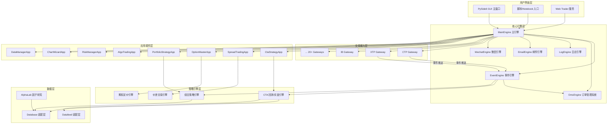
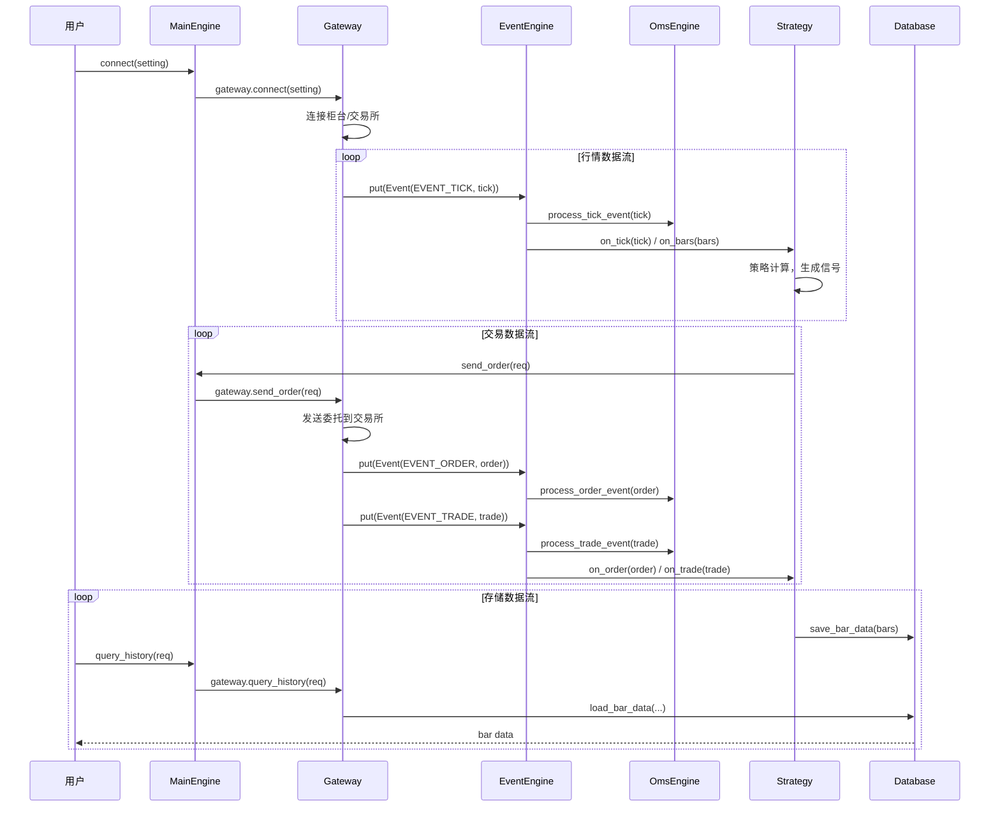

# VeighNa (vnpy) 深度分析报告

> **分析日期**: 2026-06-17
> **项目版本**: 4.4.0
> **许可证**: MIT License

## 1. 项目概述

### 1.1 项目简介

VeighNa（原vnpy）是一套基于Python的开源量化交易系统开发框架，由社区贡献者持续开发十余年，已成长为功能完备的多品种量化交易平台。项目由陈晓优创建并维护，用户群体涵盖私募基金、证券公司、期货公司等金融机构的专业交易员。项目 slogan 为 **"By Traders, For Traders, AI-Powered"**，4.0 版本开始集成 AI 量化策略能力。

### 1.2 主要特性

- **多市场交易覆盖**：支持国内外期货、证券（A股）、期权、黄金TD、资管等多种交易品种，通过 20+ 交易接口（Gateway）接入不同柜台系统
- **多元化策略引擎**：提供 CTA 策略、价差交易、期权交易、组合策略、算法交易、脚本策略等多种策略交易应用
- **AI 量化策略**：vnpy.alpha 模块提供一站式的多因子机器学习（ML）策略开发、投研和实盘交易解决方案
- **事件驱动架构**：基于事件驱动引擎（EventEngine）的核心架构，各模块间通过事件总线进行松耦合通信
- **插件化应用系统**：基于 BaseApp 的应用插件机制，支持功能模块的动态加载与热插拔
- **多数据库支持**：适配 SQLite / MySQL / PostgreSQL / MongoDB / QuestDB / TDengine / DolphinDB 等多种数据库
- **多数据服务对接**：支持米筐RQData、迅投研、TuShare、万得Wind、同花顺iFinD 等 9 种数据服务
- **多语言国际化**：内置 gettext 国际化框架，支持中英文界面切换
- **通知推送**：支持邮件和微信 iLink 协议的通知推送功能

### 1.3 版本演进

根据 CHANGELOG.md 记录，项目从 4.0.0 到 4.4.0 经历了以下里程碑：

- **4.0.0** (2024)：核心支持 Python 3.13，采用 pyproject.toml 统一项目配置，新增 vnpy.alpha AI 量化模块
- **4.1.0**：大规模升级扩展模块适配 4.0 版本，涉及 30+ 交易接口和策略应用
- **4.2.0**：vnpy.riskmanager 重构（插件式风控规则设计），新增 vnpy_polygon 数据服务，更新 CTP API 至 6.7.11
- **4.3.0**：新增 WorldQuant Alpha 101 因子数据集，增加 RGR 绩效统计指标，重构 ts_slope/ts_rsquare/ts_resi 算子
- **4.4.0**（当前版本）：新增微信 iLink 通知功能，MainEngine 统一 send_notification 接口，新增 QuestDB 时序数据库支持，重构 esunny 为启明星 V9 API

## 2. 技术栈深度剖析

| 层级 | 技术/库 | 版本 | 在项目中的作用 |
|------|---------|------|---------------|
| 语言 | Python | >= 3.10, 推荐 3.13 | 项目核心开发语言 |
| GUI 框架 | PySide6 | 6.8.2.1 | 桌面图形界面（基于 Qt6） |
| 图表库 | pyqtgraph | >= 0.13.7 | 高性能 K 线图表渲染 |
| 主题 | qdarkstyle | >= 3.2.3 | 深色界面主题 |
| 数值计算 | numpy | >= 2.2.3 | 数值计算基础库 |
| 数据处理 | pandas | >= 2.2.3 | 策略回测与数据分析 |
| 技术指标 | TA-Lib | >= 0.6.4 | 技术指标计算引擎 |
| 遗传算法 | deap | >= 1.4.2 | 策略参数优化 |
| 消息队列 | pyzmq | >= 26.3.0 | RPC 分布式通讯 |
| 可视化 | plotly | >= 6.0.0 | 策略分析图表 |
| 日志 | loguru | >= 0.7.3 | 高性能结构化日志 |
| 时区 | tzlocal | >= 5.3.1 | 本地时区识别 |
| 二维码 | qrcode | >= 7.4.2 | 微信绑定二维码生成 |
| 异步 HTTP | requests | >= 2.32.0 | HTTP 请求客户端 |
| **AI 子模块** | | | |
| 数据处理引擎 | polars | >= 1.26.0 | 高速列式 DataFrames（alpha 模块核心） |
| 科学计算 | scipy | >= 1.15.2 | 统计与优化算法 |
| 因子分析 | alphalens-reloaded | >= 0.4.5 | Alpha 因子性能评估 |
| 机器学习 | scikit-learn | >= 1.6.1 | Lasso 等经典 ML 模型 |
| 梯度提升 | lightgbm | >= 4.6.0 | LightGBM 高效 GBDT 模型 |
| 深度学习 | torch | >= 2.6.0 | MLP 神经网络模型 |
| 列式存储 | pyarrow | >= 19.0.1 | Parquet 文件读写 |
| **开发工具** | | | |
| 构建系统 | hatchling | >= 1.27.0 | 项目构建打包 |
| 静态类型 | mypy | (dev) | 类型注解检查 |
| 代码风格 | ruff | (dev) | 代码质量检查 |
| 国际化 | babel | >= 2.17.0 | gettext 国际化编译 |

**技术选型分析**：项目采用事件驱动架构设计，技术选型围绕量化交易场景的高性能和实时性需求展开。PySide6 提供跨平台桌面 GUI，pyqtgraph 实现低延迟实时 K 线绘制。alpha 子模块选用 polars（而非 pandas）作为数据处理引擎，主要是利用其向量化操作和惰性求值特性，在大规模因子计算场景中性能更优。ta-lib 作为技术指标计算的标准选择，deap 用于策略参数的遗传算法优化。

## 3. 系统架构与目录结构

### 3.1 顶层目录结构

```
vnpy-4.4.0/
├── .github/            # GitHub CI/CD 工作流配置
├── docs/               # Sphinx 文档源文件
├── examples/           # 使用示例（回测、投研 Notebook、RPC 等）
├── tests/              # 单元测试
├── vnpy/               # 核心源代码主目录
│   ├── alpha/          # AI 量化策略模块（4.0 新增）
│   ├── chart/          # 高性能 K 线图表组件
│   ├── event/          # 事件驱动引擎
│   ├── rpc/            # 跨进程 RPC 通讯组件
│   ├── trader/         # 核心交易平台
│   │   ├── ui/         # Qt GUI 界面组件
│   │   └── locale/     # 国际化翻译文件
│   └── __init__.py     # 版本定义
├── pyproject.toml      # 项目元数据与依赖配置
├── CHANGELOG.md        # 版本变更日志
├── LICENSE             # MIT 许可证
└── README.md           # 项目介绍（中/英文）
```

### 3.2 核心模块目录职责

| 目录/模块 | 职责说明 | 关键文件 |
|-----------|---------|---------|
| `vnpy/trader/` | **交易核心平台**，包含主引擎、OMS、网关抽象、数据模型、数据库适配层、数据服务适配层、日志系统、通知引擎 | `engine.py`, `gateway.py`, `object.py`, `setting.py`, `database.py`, `datafeed.py` |
| `vnpa/event/` | **事件驱动引擎**，提供事件发布-订阅机制、定时器事件 | `engine.py` |
| `vnpy/chart/` | **K线图表组件**，基于 pyqtgraph 实现高性能行情图表 | `widget.py`, `item.py`, `axis.py` |
| `vnpy/rpc/` | **RPC 通讯组件**，基于 pyzmq 实现跨进程分布式通讯 | `server.py`, `client.py`, `common.py` |
| `vnpy/trader/ui/` | **Qt GUI 界面**，包含主窗口、各种监控组件、交易组件 | `mainwindow.py`, `widget.py`, `qt.py` |
| `vnpy/alpha/` | **AI 量化策略模块**，因子工程、ML 模型训练、策略回测 | `lab.py`, `dataset/`, `model/`, `strategy/` |

### 3.3 系统架构图



### 3.4 核心数据流



### 3.5 模块依赖关系

- **核心中枢**: `vnpy/trader/engine.py` 中的 MainEngine 是系统最核心的模块，所有其他模块都直接或间接依赖它
- **事件总线**: `vnpy/event/engine.py` 的 EventEngine 被所有模块依赖，是整个系统的通信基础设施
- **数据模型**: `vnpy/trader/object.py` 定义的数据类（TickData/OrderData/TradeData 等）被全部模块引用，是系统的一致数据契约
- **无循环依赖**: 项目通过事件驱动模式避免了模块间的循环依赖，依赖方向为：UI → MainEngine → Gateway/App，数据流通过 EventEngine 反向传递
- **松耦合设计**: 各策略 App 之间相互独立，Gateway 之间也相互独立，新增交易接口或策略应用无需修改核心框架

## 4. 配置系统分析

### 4.1 配置方式

| 配置来源 | 优先级 | 加载方式 | 典型配置项 |
|---------|--------|---------|-----------|
| JSON 配置文件 | 中 | `setting.py` 启动时加载 `vt_setting.json` | 字体、日志、数据库、邮件、数据服务 |
| Gateway 连接配置 | 运行时 | 通过 UI 连接对话框或 `connect(setting)` 传入 | 柜台地址、账号密码、AppID |
| JSON 持久化 | 运行时 | `utility.save_json()` / `load_json()` | 微信绑定信息、窗口布局等 |
| 环境变量 | 低 | 间接使用（通过第三方库） | 时区（通过 tzlocal 自动检测） |

### 4.2 核心配置项详解

| 参数名 | 类型 | 默认值 | 说明 |
|--------|------|--------|------|
| `font.family` | str | "微软雅黑" | 界面字体 |
| `font.size` | int | 12 | 界面字号 |
| `log.active` | bool | True | 是否启用日志 |
| `log.level` | int | INFO (20) | 日志级别 |
| `log.console` | bool | True | 是否输出到控制台 |
| `log.file` | bool | True | 是否写入日志文件 |
| `email.server` | str | "smtp.qq.com" | 邮件 SMTP 服务器 |
| `email.port` | int | 465 | SMTP 端口 |
| `email.username` | str | "" | 邮箱用户名 |
| `email.password` | str | "" | 邮箱密码/授权码 |
| `email.sender` | str | "" | 发件人地址 |
| `email.receiver` | str | "" | 收件人地址 |
| `datafeed.name` | str | "" | 数据服务名称（如 rqdata, xt） |
| `datafeed.username` | str | "" | 数据服务用户名 |
| `datafeed.password` | str | "" | 数据服务密码 |
| `database.timezone` | str | 自动检测 | 数据库时区 |
| `database.name` | str | "sqlite" | 数据库类型 |
| `database.database` | str | "database.db" | 数据库文件/名称 |
| `database.host` | str | "" | 数据库主机地址 |
| `database.port` | int | 0 | 数据库端口 |
| `database.user` | str | "" | 数据库用户 |
| `database.password` | str | "" | 数据库密码 |

### 4.3 配置加载流程

1. **默认配置定义**: 在 [setting.py](file:///d:/develop/vnpy-4.4.0/vnpy/trader/setting.py#L8-L26) 中定义 `SETTINGS` 字典，包含所有配置项的默认值
2. **JSON 覆盖**: 自动从 `.vntrader/vt_setting.json` 加载用户自定义配置，通过 `SETTINGS.update(load_json(SETTING_FILENAME))` 合并到默认配置上
3. **运行时配置**: Gateway 的连接参数在 UI 连接对话框或脚本调用 `main_engine.connect(setting, gateway_name)` 时传入
4. **持久化配置**: WechatEngine 通过 `wechat_setting.json` 独立管理微信绑定信息

## 5. 核心模块源码解析

### 5.1 MainEngine - 交易平台主引擎

- **文件位置**: [vnpy/trader/engine.py](file:///d:/develop/vnpy-4.4.0/vnpy/trader/engine.py)
- **核心类/函数**:
  - `MainEngine.__init__` ([L74-L90](file:///d:/develop/vnpy-4.4.0/vnpy/trader/engine.py#L74-L90)): 构造函数，初始化事件引擎、网关、引擎、应用注册表
  - `MainEngine.add_gateway` ([L98-L111](file:///d:/develop/vnpy-4.4.0/vnpy/trader/engine.py#L98-L111)): 注册交易接口
  - `MainEngine.add_app` ([L113-L120](file:///d:/develop/vnpy-4.4.0/vnpy/trader/engine.py#L113-L120)): 注册策略应用插件
  - `MainEngine.init_engines` ([L122-L151](file:///d:/develop/vnpy-4.4.0/vnpy/trader/engine.py#L122-L151)): 初始化 OMS、Email、Wechat 等内置引擎
  - `MainEngine.send_order` ([L204-L213](file:///d:/develop/vnpy-4.4.0/vnpy/trader/engine.py#L204-L213)): 下单入口，委托转发到对应 Gateway
- **功能描述**: MainEngine 是整个交易系统的核心控制器，管理所有的网关（Gateway）、引擎（Engine）和应用（App）。它对外提供统一的交易接口（下单、撤单、订阅行情、查询历史等），内部通过事件引擎实现模块间通信。
- **实现原理**:
  1. 启动时创建 EventEngine 并启动事件循环线程
  2. 调用 `init_engines()` 初始化 OmsEngine、LogEngine、EmailEngine、WechatEngine 四个内置引擎
  3. OmsEngine 在初始化时自动注册 EVENT_TICK/EVENT_ORDER/EVENT_TRADE 等事件监听
  4. 用户通过 `add_gateway()` 添加交易接口，通过 `add_app()` 添加策略应用
  5. 交易操作（send_order/cancel_order/subscribe）通过 MainEngine 中转委托给对应 Gateway
  6. Gateway 将回报数据包装为 Event 对象放入 EventEngine 的队列中，由事件循环分发给已注册的 Handler
- **设计模式**: **外观模式（Facade）** - MainEngine 为所有子系统（Gateway、App、Engine）提供统一的访问接口；**中介者模式（Mediator）** - 协调各组件之间的交互，避免直接耦合
- **复杂度分析**: MainEngine 本身是薄外观层（Facade），复杂度 O(1)。主要复杂度在 OmsEngine 的事件处理逻辑中，每个事件处理器为 O(n) 的字典查询

### 5.2 EventEngine - 事件驱动引擎

- **文件位置**: [vnpy/event/engine.py](file:///d:/develop/vnpy-4.4.0/vnpy/event/engine.py)
- **核心类/函数**:
  - `Event` ([L14-L20](file:///d:/develop/vnpy-4.4.0/vnpy/event/engine.py#L14-L20)): 事件对象，包含 type 和 data
  - `EventEngine.__init__` ([L29-L39](file:///d:/develop/vnpy-4.4.0/vnpy/event/engine.py#L29-L39)): 初始化事件队列、线程、Handler 注册表
  - `EventEngine._run` ([L41-L50](file:///d:/develop/vnpy-4.4.0/vnpy/event/engine.py#L41-L50)): 事件处理主循环，从队列中取出事件并分发
  - `EventEngine._process` ([L52-L61](file:///d:/develop/vnpy-4.4.0/vnpy/event/engine.py#L52-L61)): 先按事件类型分发，再分发给通用 Handler
  - `EventEngine.register` ([L87-L93](file:///d:/develop/vnpy-4.4.0/vnpy/event/engine.py#L87-L93)): 注册指定事件类型的处理函数
- **功能描述**: 事件驱动引擎是整个 VeighNa 系统的通信 backbone，负责实现生产者-消费者模式的事件异步处理。Gateway 产生行情/交易事件，各策略引擎和 OMS 消费事件。
- **实现原理**:
  1. EventEngine 启动时创建两个线程：`_thread`（事件处理线程）和 `_timer`（定时器线程）
  2. `_thread` 线程调用 `_run()` 方法，循环从 `self._queue`（Queue 类型）中获取 Event 对象
  3. `_process()` 方法先将事件分发给 `self._handlers[event.type]` 中注册的特定 Handler，再分发给 `self._general_handlers` 中的通用 Handler
  4. `_timer` 线程每隔 `self._interval` 秒（默认 1 秒）生成一个 EVENT_TIMER 事件
  5. Handler 注册表 `_handlers` 使用 `defaultdict(list)`，同一事件类型可注册多个 Handler
- **设计模式**: **观察者模式（Observer）** - EventEngine 是被观察主题（Subject），各 Handler 是观察者；**生产者-消费者模式** - Gateway 是生产者，EventEngine 的线程是消费者

### 5.3 OmsEngine - 订单管理系统

- **文件位置**: [vnpy/trader/engine.py#L360-L480](file:///d:/develop/vnpy-4.4.0/vnpy/trader/engine.py#L360-L480)
- **核心类/函数**:
  - `OmsEngine.register_event` ([L386-L395](file:///d:/develop/vnpy-4.4.0/vnpy/trader/engine.py#L386-L395)): 注册 7 种核心事件类型的处理器
  - `OmsEngine.process_tick_event` ([L397-L399](file:///d:/develop/vnpy-4.4.0/vnpy/trader/engine.py#L397-L399)): Tick 行情数据缓存
  - `OmsEngine.process_order_event` ([L401-L415](file:///d:/develop/vnpy-4.4.0/vnpy/trader/engine.py#L401-L415)): 订单状态跟踪，更新活动订单和 OffsetConverter
  - `OmsEngine.process_trade_event` ([L417-L424](file:///d:/develop/vnpy-4.4.0/vnpy/trader/engine.py#L417-L424)): 成交记录缓存，更新 OffsetConverter
- **功能描述**: OmsEngine 是系统内部的状态管理中枢，维护所有运行时数据的本地缓存（行情快照、订单状态、成交记录、持仓、账户资金、合约信息），并向 MainEngine 提供 16 个查询接口。同时管理 OffsetConverter，实现开平仓转换逻辑。
- **实现原理**:
  1. 初始化时创建 7 个字典（ticks/orders/trades/positions/accounts/contracts/quotes）作为内存缓存
  2. 通过 `register_event()` 注册 EVENT_TICK/EVENT_ORDER/EVENT_TRADE/EVENT_POSITION/EVENT_ACCOUNT/EVENT_CONTRACT/EVENT_QUOTE 的事件监听
  3. 每个事件处理器将最新数据写入字典缓存，同时维护 `active_orders` 和 `active_quotes` 活动状态集合
  4. 在 `process_contract_event` 中为每个 Gateway 延迟初始化 `OffsetConverter`
  5. 所有订单、成交、持仓事件都会同步到 OffsetConverter 以维护开仓/平仓状态
- **设计模式**: **缓存代理模式（Cache Proxy）** - 作为底层 Gateway 数据的内存缓存，避免重复查询

### 5.4 BaseGateway - 交易接口抽象基类

- **文件位置**: [vnpy/trader/gateway.py](file:///d:/develop/vnpy-4.4.0/vnpy/trader/gateway.py)
- **核心类/函数**:
  - `BaseGateway.on_event` ([L67-L71](file:///d:/develop/vnpy-4.4.0/vnpy/trader/gateway.py#L67-L71)): 通用事件推送
  - `BaseGateway.on_tick` ([L73-L77](file:///d:/develop/vnpy-4.4.0/vnpy/trader/gateway.py#L73-L77)): Tick 行情事件推送（含 vt_symbol 粒度订阅）
  - `BaseGateway.on_order` / `on_trade` / `on_position` / `on_account` / `on_contract` / `on_quote`: 各类型事件的推送函数
  - `BaseGateway.connect` (抽象方法, [L168-L188](file:///d:/develop/vnpy-4.4.0/vnpy/trader/gateway.py#L168-L188)): 连接柜台，需要实现连接、合约查询、持仓查询等
  - `BaseGateway.send_order` (抽象方法, [L195](file:///d:/develop/vnpy-4.4.0/vnpy/trader/gateway.py#L195)): 发送委托
- **功能描述**: BaseGateway 是交易接口的抽象基类，定义了所有交易接口（CTP、XTP、IB 等）必须实现的接口规范。Gateway 的设计要求线程安全、非阻塞、自动重连。
- **实现原理**:
  1. 每个 Gateway 实例通过 `event_engine.put()` 推送事件，数据反向上报
  2. `on_tick`/`on_order` 等函数同时推送全局事件和针对特定 vt_symbol/vt_orderid 的精细化事件（如 `EVENT_TICK + tick.vt_symbol`），允许精确订阅
  3. Gateway 通过 `default_setting` 类变量声明连接配置项，UI 自动解析生成连接对话框
  4. `on_event` 统一入口，将 Event 对象放入事件引擎队列
- **设计模式**: **模板方法模式（Template Method）** - BaseGateway 定义了 connect/subscribe/send_order/cancel_order/close 的抽象方法，具体的 CTPGateway/XTPGateway 等实现这些方法；**观察者模式（Observer）** - Gateway 作为事件源，EventEngine 作为事件总线

### 5.5 vnpy.alpha - AI 量化策略模块

- **文件位置**: [vnpy/alpha/](file:///d:/develop/vnpy-4.4.0/vnpy/alpha/)
- **核心类/函数**:
  - `AlphaLab` ([vnpy/alpha/lab.py](file:///d:/develop/vnpy-4.4.0/vnpy/alpha/lab.py)): 投研实验室，管理因子研究的完整数据流程
  - `AlphaDataset` ([vnpy/alpha/dataset/template.py](file:///d:/develop/vnpy-4.4.0/vnpy/alpha/dataset/template.py)): 数据集模板，定义因子特征与标签
  - `AlphaModel` ([vnpy/alpha/model/template.py](file:///d:/develop/vnpy-4.4.0/vnpy/alpha/model/template.py)): ML 模型模板，统一 fit/predict 接口
  - `AlphaStrategy` ([vnpy/alpha/strategy/template.py](file:///d:/develop/vnpy-4.4.0/vnpy/alpha/strategy/template.py)): 策略模板，支持截面多标的和时序单标的策略
  - `DataProxy` ([vnpy/alpha/dataset/utility.py](file:///d:/develop/vnpy-4.4.0/vnpy/alpha/dataset/utility.py)): 因子表达式计算引擎，支持运算符重载
- **功能描述**: vnpy.alpha 是 4.0 版本引入的 AI 量化策略模块，为专业量化交易员提供一站式多因子机器学习策略开发、投研和实盘交易解决方案。采用 Qlib 启发的设计理念，集成因子工程、模型训练、策略回测完整工作流。
- **实现原理**:
  1. **因子工程**: AlphaDataset 定义因子表达式（Expression），通过 `DataProxy` 实现 DataFrame 运算符重载，支持 `ts_sum(x, 5)`、`cs_rank(close)` 等时序和截面算子
  2. **模型训练**: AlphaModel 提供统一的 `fit(dataset)` 和 `predict(dataset, segment)` 接口，内置 Lasso、LightGBM、MLP 三种模型实现
  3. **策略开发**: AlphaStrategy 支持截面多标的策略（基于所有标的的预测信号）和时序单标的策略（基于单一标的的预测信号）
  4. **投研流程**: AlphaLab 管理从数据下载、因子计算、模型训练、信号生成到策略回测的完整工作流，数据以 Parquet 格式存储
- **设计模式**: **策略模式（Strategy）** - AlphaModel 定义了模型训练的通用接口，LassoModel/LGBModel/MLPModel 提供不同算法实现；**模板方法模式** - AlphaDataset 和 AlphaStrategy 定义了数据处理和策略执行的模板流程
- **关键代码片段** - DataProxy 表达式计算:
  ```python
  # DataProxy 支持运算符重载实现因子表达式
  class DataProxy:
      def __add__(self, other): ...
      def __sub__(self, other): ...
      def __mul__(self, other): ...
      # ... 以及时序函数 ts_sum, ts_mean, ts_std 等
  ```
- **复杂度分析**: 因子计算采用 polars 向量化操作，性能 O(n) vs 逐行 O(n²)。LightGBM 训练复杂度 O(#leaves * #data * #features)，通过早停（Early Stopping）防止过拟合

## 6. 接口与API文档

### 6.1 CLI 接口

VeighNa 本身不提供直接 CLI 工具，但支持通过 Python 脚本启动。典型的启动脚本如下：

```python
from vnpy.event import EventEngine
from vnpy.trader.engine import MainEngine
from vnpy.trader.ui import MainWindow, create_qapp
from vnpy_ctp import CtpGateway
from vnpy_ctastrategy import CtaStrategyApp

def main():
    qapp = create_qapp()
    event_engine = EventEngine()
    main_engine = MainEngine(event_engine)
    main_engine.add_gateway(CtpGateway)
    main_engine.add_app(CtaStrategyApp)
    main_window = MainWindow(main_engine, event_engine)
    main_window.showMaximized()
    qapp.exec()

if __name__ == "__main__":
    main()
```

### 6.2 编程接口（Public API）

| 类/函数 | 签名 | 说明 |
|---------|------|------|
| `MainEngine.__init__` | `(event_engine: EventEngine \| None = None) -> None` | 创建主引擎 |
| `MainEngine.add_gateway` | `(gateway_class: type[BaseGateway], gateway_name: str = "") -> BaseGateway` | 注册交易接口 |
| `MainEngine.add_app` | `(app_class: type[BaseApp]) -> BaseEngine` | 注册策略应用 |
| `MainEngine.connect` | `(setting: dict, gateway_name: str) -> None` | 连接柜台 |
| `MainEngine.subscribe` | `(req: SubscribeRequest, gateway_name: str) -> None` | 订阅行情 |
| `MainEngine.send_order` | `(req: OrderRequest, gateway_name: str) -> str` | 发送委托 |
| `MainEngine.cancel_order` | `(req: CancelRequest, gateway_name: str) -> None` | 撤销委托 |
| `MainEngine.send_quote` | `(req: QuoteRequest, gateway_name: str) -> str` | 发送报价 |
| `MainEngine.query_history` | `(req: HistoryRequest, gateway_name: str) -> list[BarData]` | 查询历史数据 |
| `MainEngine.send_notification` | `(content: str, subject: str \| None = None) -> None` | 发送通知 |
| `EventEngine.register` | `(type: str, handler: HandlerType) -> None` | 注册事件监听 |
| `EventEngine.put` | `(event: Event) -> None` | 发布事件 |

### 6.3 REST API 端点（如有）

本项目为桌面应用框架，不内置 REST API。但通过 `vnpy_webtrader` 扩展模块可提供 REST + WebSocket 的 Web 服务接口。

## 7. 数据库与存储

### 7.1 存储方案

本项目采用**可插拔数据库适配层**设计，不绑定特定数据库。默认使用 SQLite 轻量级文件数据库，支持通过配置切换为：

| 数据库类型 | 模块 | 特点 |
|-----------|------|------|
| SQLite | vnpy_sqlite | 轻量级、零配置，适合个人用户 |
| MySQL | vnpy_mysql | 主流关系型数据库，支持 TiDB 兼容 |
| PostgreSQL | vnpy_postgresql | 功能丰富的开源关系型数据库 |
| QuestDB | vnpy_questdb | 高性能列式时序数据库 |
| TDengine | vnpy_taos | 分布式时序数据库，内置缓存和流式计算 |
| DolphinDB | vnpy_dolphindb | 高性能分布式时序数据库 |
| MongoDB | vnpy_mongodb | 文档式 NoSQL 数据库 |

### 7.2 数据模型

数据库适配层主要通过 `BaseDatabase` 抽象类定义接口，通过 BarOverview 和 TickOverview 描述存储状况。

#### BarOverview

| 字段 | 类型 | 约束 | 说明 |
|------|------|------|------|
| `symbol` | str | 主键 | 合约代码 |
| `exchange` | Exchange | - | 交易所 |
| `interval` | Interval | - | K 线周期 |
| `count` | int | - | 数据条数 |
| `start` | datetime | - | 起始时间 |
| `end` | datetime | - | 结束时间 |

#### TickOverview

| 字段 | 类型 | 约束 | 说明 |
|------|------|------|------|
| `symbol` | str | 主键 | 合约代码 |
| `exchange` | Exchange | - | 交易所 |
| `count` | int | - | 数据条数 |
| `start` | datetime | - | 起始时间 |
| `end` | datetime | - | 结束时间 |

### 7.3 数据生命周期

1. **数据采集**: Gateway 从交易所接收 Tick/Bar 数据，通过事件引擎推送到系统
2. **数据缓存**: DataRecorder 应用监听行情事件，实时写入数据库
3. **数据存储**: 通过 `BaseDatabase.save_bar_data()` / `save_tick_data()` 持久化
4. **数据查询**: 通过 `BaseDatabase.load_bar_data()` / `load_tick_data()` 加载回测数据
5. **数据管理**: DataManager 应用提供 GUI 进行数据浏览、CSV 导入导出

### 7.4 数据库迁移

项目未使用数据库迁移工具。数据库表结构由具体数据库适配器内部定义和维护。默认 SQLite 适配器自动创建表结构。

## 8. 测试与质量保障

### 8.1 测试概览

| 维度 | 数据 |
|------|------|
| 测试框架 | pytest |
| 测试文件数 | 2 |
| 源文件数 | ~50+ |
| 测试/源码比例 | 低 |
| 断言库 | numpy.testing, pytest |
| CI/CD | GitHub Actions (Windows-latest, Python 3.13) |

### 8.2 测试结构分析

测试位于 `tests/` 目录下，分为两个测试文件：

- `tests/test_alpha101.py`: 针对 Alpha 101 因子数据集的集成测试，使用 pytest fixture 生成合成测试数据，验证因子表达式计算引擎的正确性
- `tests/alpha/test_dataproxy.py`: 针对 DataProxy 运算符重载的单元测试，覆盖算术运算（加减乘除、取模、幂运算）、反向运算、一元运算、比较运算等

### 8.3 模块测试覆盖评估

| 模块 | 测试覆盖度 | 评估 |
|------|-----------|------|
| vnpy.alpha (DataProxy) | ✅ 良好 | 系统的运算符重载测试，覆盖所有算数/比较/一元操作 |
| vnpy.alpha (Alpha 101) | ⚠️ 部分 | 仅验证因子表达式可执行，未验证数值正确性 |
| vnpy.trader | ❌ 缺失 | 核心交易引擎、Gateway、OMS 等无单元测试 |
| vnpy.event | ❌ 缺失 | 事件引擎无单元测试 |
| vnpy.rpc | ❌ 缺失 | RPC 组件无单元测试 |

### 8.4 代码质量工具

| 工具类型 | 工具名称 | 配置文件 |
|---------|---------|---------|
| Linter | ruff | [pyproject.toml](file:///d:/develop/vnpy-4.4.0/pyproject.toml#L65-L77) |
| Type Checker | mypy | [pyproject.toml](file:///d:/develop/vnpy-4.4.0/pyproject.toml) |
| Formatter | ruff (内置) | 同 linter 配置 |
| Build System | hatchling | [pyproject.toml](file:///d:/develop/vnpy-4.4.0/pyproject.toml#L59-L62) |

## 9. 二次开发指南

### 9.1 环境搭建与本地运行

1. **前置条件**: Python >= 3.10 (64位)，推荐 Python 3.13
2. **克隆仓库**: `git clone https://github.com/vnpy/vnpy.git`
3. **安装依赖**:
   ```bash
   cd vnpy
   pip install -e .           # 安装核心框架
   pip install -e .[alpha]     # 安装 AI 模块额外依赖
   ```
4. **配置**: 登录 [SimNow](http://www.simnow.com.cn/) 注册 CTP 仿真账号
5. **运行图形界面**:
   ```bash
   cd examples/veighna_trader
   python run.py
   ```
6. **验证**: 启动后应看到 VeighNa Trader 主窗口，可连接仿真交易接口

### 9.2 核心扩展点

| 扩展点 | 位置 | 扩展方式 | 示例 |
|--------|------|---------|------|
| 交易接口 Gateway | `vnpy/trader/gateway.py` | 继承 `BaseGateway`，实现 `connect/subscribe/send_order/cancel_order/close` | vnpy_ctp、vnpy_xtp |
| 策略应用 App | `vnpy/trader/app.py` | 继承 `BaseApp`，实现 `app_name/engine_class/widget_name` 等类变量 | vnpy_ctastrategy、vnpy_spreadtrading |
| 策略类 | 各 App 内部 | 继承对应策略模板（如 `CtaTemplate`、`AlphaStrategy`），实现策略逻辑 | CtaStrategy Demo |
| 数据库适配器 | `vnpy/trader/database.py` | 继承 `BaseDatabase`，实现 CRUD 方法 | vnpy_mysql、vnpy_mongodb |
| 数据服务适配器 | `vnpy/trader/datafeed.py` | 继承 `BaseDatafeed`，实现行情历史查询 | vnpy_rqdata、vnpy_tushare |
| ML 模型 | `vnpy/alpha/model/template.py` | 继承 `AlphaModel`，实现 `fit/predict` | LassoModel、LGBModel |
| 风控规则 | RiskManager | 放置在 `.vntrader/rules/` 目录下自动扫描加载 | v4.2.0 新增功能 |

### 9.3 典型开发流程

**添加一个新的策略**:

1. 创建策略类，继承 CTA 策略模板
2. 实现 `on_init/on_start/on_stop/on_tick/on_bars/on_order/on_trade` 回调
3. 通过图形界面加载策略、设置参数、启动运行
4. 通过回测引擎验证策略历史表现

**添加一个新的交易接口**:

1. 创建 Gateway 类，继承 `BaseGateway`
2. 实现底层 API 封装和接口回调
3. 通过 `add_gateway()` 注册到 MainEngine
4. 通过连接对话框配置并连接

### 9.4 代码质量评估

| 维度 | 评分 | 说明 |
|------|------|------|
| 代码组织与可读性 | ⭐⭐⭐⭐⭐ | 清晰的模块分层，一致的命名规范（PEP8），完整的中英文双语代码注释 |
| 模块化与解耦程度 | ⭐⭐⭐⭐⭐ | 基于事件驱动的松耦合架构，Gateway/App/Engine 三大组件体系，插件化设计 |
| 测试覆盖与质量 | ⭐⭐☆☆☆ | 仅 alpha 模块有较完整的单元测试，核心引擎（MainEngine/EventEngine/Gateway）无测试 |
| 文档完善度 | ⭐⭐⭐⭐☆ | 完善的 Sphinx 文档、中文 README、CHANGELOG 详实、社区论坛活跃 |
| 错误处理与健壮性 | ⭐⭐⭐⭐☆ | Gateway 有自动重连机制，日志系统完善，但部分异常路径缺少处理 |
| 性能与优化 | ⭐⭐⭐⭐⭐ | 事件驱动高并发架构、polars 向量化计算、pyqtgraph 高性能图表 |
| 安全性 | ⭐⭐⭐☆☆ | 密码等敏感信息以明文存储在 JSON 文件中，缺乏加密存储机制 |

### 9.5 改进建议

1. **增强测试覆盖度**: 核心引擎（MainEngine/EventEngine）缺乏单元测试，建议引入 pytest 对事件分发、订单状态转换、持仓计算等关键逻辑进行覆盖
2. **敏感信息安全存储**: Gateway 连接密码、邮箱授权码等敏感信息以明文存储在 JSON 配置文件中，建议引入 keyring 或加密存储方案
3. **国际化完善**: 当前 I18n 翻译文件（`.po`/`.mo`）仅更新了英文部分，建议增加更多语言的翻译支持，或将翻译工作流与 CI/CD 集成
4. **环境变量配置支持**: 配置系统目前仅通过 JSON 文件加载，建议增加环境变量覆盖机制，便于容器化部署（Docker）的场景

## 10. 安全分析

### 10.1 依赖安全

项目依赖较多（核心 15+，alpha 额外 7+），部分依赖版本较新（ta-lib 0.6.4、PySide6 6.8.2.1）。CI/CD 中已集成依赖安全检查。建议定期运行 `pip audit` 或集成 Dependabot 进行自动依赖漏洞扫描。

### 10.2 代码安全实践

- **输入验证**: Gateway 层对交易接口返回的数据有基本类型校验，但用户输入（如策略参数）验证较宽松
- **认证/授权**: 交易接口认证委托给底层柜台系统（如 CTP），框架层面无额外认证层
- **敏感信息管理**: 密码/Token 等以 JSON 明文存储，存在安全风险（见改进建议 2）
- **日志与监控**: 使用 loguru 全面记录交易操作日志，包括下单、撤单、连接等关键操作，有助于事后审计

## 11. 性能分析

### 11.1 性能关键路径

- **行情处理链路**: Gateway → EventEngine → OmsEngine → Strategy，全程为内存队列 + 事件驱动，延迟亚毫秒级
- **交易执行链路**: Strategy → MainEngine → Gateway → 柜台，网络延迟为主要瓶颈
- **因子计算**: DataProxy 使用 polars 向量化引擎，单次全数据集因子计算性能 O(n)
- **模型训练**: Lasso 模型复杂度 O(n_features² × n_samples)，LightGBM 使用直方图算法加速

### 11.2 并发模型

- **事件驱动并发**: EventEngine 使用单线程事件循环 + 独立定时器线程，避免竞态条件
- **Gateway 线程**: 每个 Gateway 内部维护独立线程处理柜台连接，通过 `event_engine.put()` 将数据推送到主事件循环
- **RPC 分布式**: 通过 pyzmq 实现多进程分布式部署，支持服务端/客户端模式
- **无 GIL 限制**: Gateway 的 C++ 底层封装和 numpy/polars 计算均在 GIL 之外运行

### 11.3 优化策略

- **批量操作**: 数据库写入支持 `stream=True` 模式，批量提交减少 I/O
- **惰性计算**: polars 的惰性求值（LazyFrame）允许查询优化器自动优化执行计划
- **内存缓存**: OmsEngine 维护全量运行时数据的内存缓存，避免频繁数据库查询
- **连接池**: 数据库适配层（如 QuestDB、TDengine）支持连接池复用

---

> **免责声明**: 本报告由 AI 分析工具自动生成，基于对 `vnpy` (VeighNa) 项目源代码的静态分析。部分信息可能与实际情况存在偏差，请以项目官方文档为准。